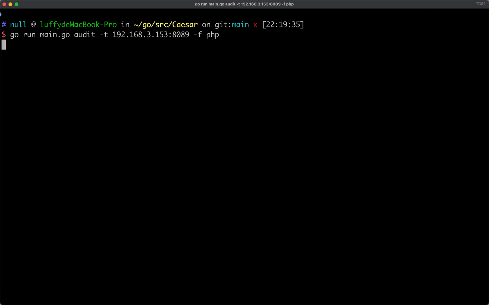

# 🏁Caesar
☠️**Caesar一个全新的敏感文件发现工具**

## 👻项目简介
文件扫描是安服的一个基本环节，网络上关于文件扫描的工具也有很多，比如御剑，7kbscan，dirsearch等，但是在实战的时候还是遇到不少的问题，比如跨平台问题以及动态404问题。所以按照自己的经验重新造了一个轮子。
## 😈项目特性
* 一 **支持主流平台**: 得益于golang的跨平台优势。一次编译，到处运行。
* 二 **强大的并发**: golang的并发独树一帜。12线程下能实现每秒千级请求。为了安全性，默认只设置了3线程。
* 三 **路径记忆功能**: Caesar可以记忆路径的击中次数，下次运行的时候，击中次数多的路径优先级会提高。
* 四 **动态404判断**: 针对网站不存在页面返回的404,200,3xx状态码可以自动识别判断。
* 五 **动态文件后缀扫描功能**: 比如发现index.php之后，程序会在二段扫描中扫描index.php.txt, index.php.swp, index.php.bak。
* 六 **动态目录扫描功能**: 比如发现/admin之后，程序会在二段扫描中扫描admin.zip, admin.rar, admin.tar, admin.tar.gz。
* 七 **可自定义http请求头**: 修改config.yml的Headers可以添加请求头内容。
* 八 **可自定义User-Agent**: 修改config.yml的UserAgent可以实现随机UA。
* 九 **可自定义代理**: 修改config.yml的Proxy可以实现代理访问。
* 十 **可自定义cookie**: 修改config.yml的Cookie在访问网站的时候会带着cookie。
* 十一 **超大字典**: 程序自带common,jsp,asp,php,spring,weblogic字典，合计超10万条路径，当然也可以自己定制。
* 十二 **错误次数太多自动退出功能**: 访问目标超时次数到达一定数量的时候会自动终止任务。
* 十三 **支持-r读取http请求**: 类似sqlmap的-r功能。
* 十四 **支持批量扫描**: 可以从文本中获取多目标。
## 🏉需要的编译环境
Golang 1.15(推荐)
## 🥋结果保存
日志和发现的信息会保存在results目录下
## 🥎路径字典
路径字典在assets/directory目录下，相比于其他的程序的路径文本字典，Caesar的路径字典是json，可以通过
```shell script
caesar convert -d ~/path/ 
```
将普通路径字典转换为程序能识别的json字典。将转换后的字典放在assets/directory目录下即可。
## 🏀第三方框架
* [pb](https://github.com/cheggaaa/pb) - 终端进度条实现
* [logrus](https://github.com/sirupsen/logrus) - 一个非常简单但强大的日志记录器
* [cobra](https://github.com/spf13/cobra) - Cobra既是一个用来创建强大的现代CLI命令行的golang库,也是一个生成程序应用和命令行文件的程序
* [fasthttp](https://github.com/valyala/fasthttp) - fasthttp是Go的快速 HTTP 实现
## 🥂TODO
- [ ] 常见MVC框架的识别和字典优化。一个spring框架用.jsp的路径扫描显然不合适
- [ ] 目录迭代扫描
- [ ] 常见WAF阻止后缀的识别。WAF会阻止类似/www.zip 的请求，返回不同于应用程序本身的ban信息
- [ ] 项目的持续优化和bug修复
- [ ] 403目录绕过功能
## 🏈贡献
如果你擅长go语言，并且有好的想法，欢迎你提交requests
## 👮🏻‍免责声明
本工具仅能在取得足够合法授权的企业安全建设中使用，在使用本工具过程中，您应确保自己所有行为符合当地的法律法规。 如您在使用本工具的过程中存在任何非法行为，您将自行承担所有后果，本工具所有开发者和所有贡献者不承担任何法律及连带责任。 除非您已充分阅读、完全理解并接受本协议所有条款，否则，请您不要安装并使用本工具。 您的使用行为或者您以其他任何明示或者默示方式表示接受本协议的，即视为您已阅读并同意本协议的约束。
## 🏓版权协议
该项目签署了GPL-3.0授权许可，详情请参阅[COPING](docs/COPYING)。
## 🤝外链
如果你觉得有趣的话，可以关注我的公众号。

## 📷相关项目
* [dirsearch](https://github.com/maurosoria/dirsearch) - 非常棒的目录扫描工具
* [dirmap](https://github.com/H4ckForJob/dirmap) - flag很高的工具，可惜不更新了